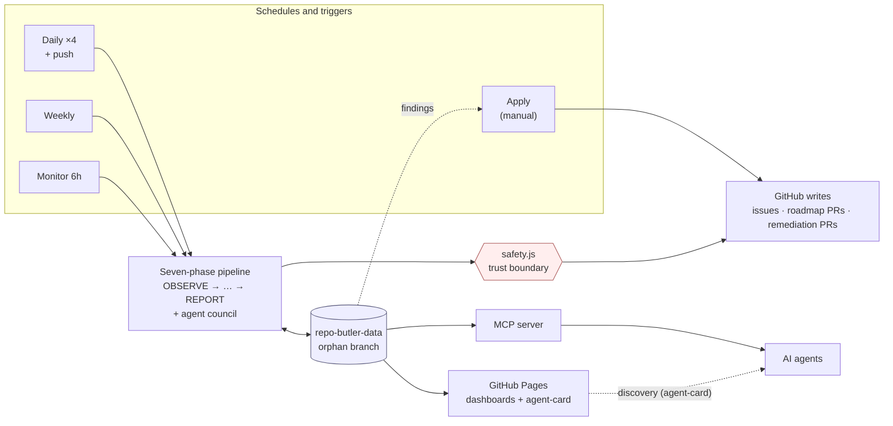
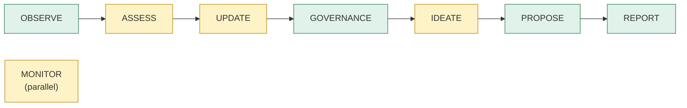
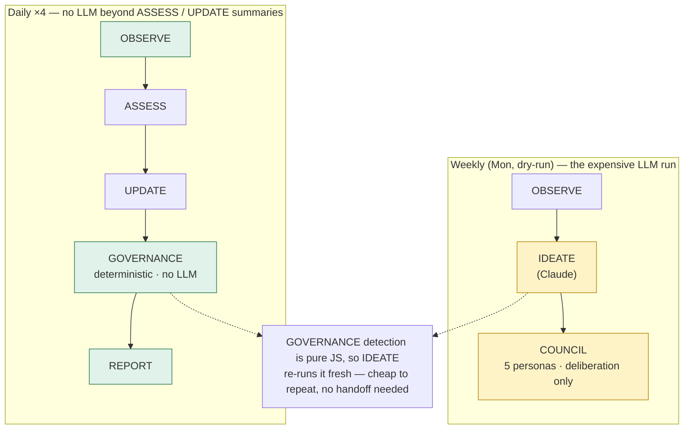
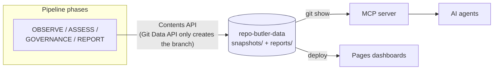
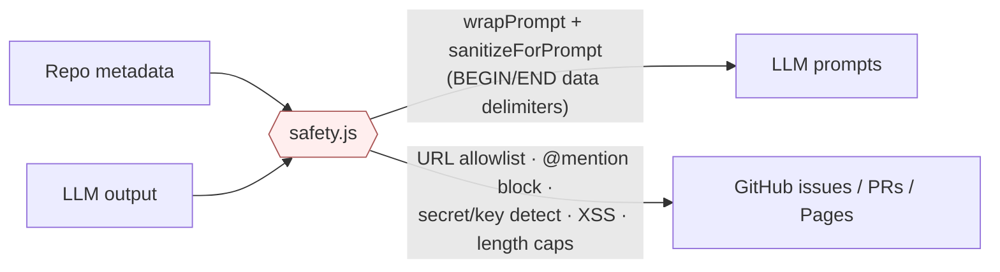

# How Repo Butler Works

This is the architecture doc — the full picture of how the pieces tie together,
read top to bottom in three layers. First, in plain terms, what the butler does.
Then the seven-phase flow that does it. Then "the magic" — the handful of design
choices that make it cheap, safe, and agent-consumable — followed by a deep dive
into the data branch, the safety boundary, and how to extend it.

## What it does

Repo Butler is a roadmap planner that runs itself. On a schedule it looks at a
whole portfolio of GitHub repositories, scores each one's health, drafts roadmap
updates, finds governance gaps, brainstorms improvements (with an AI council
voting on them), files the good ones as issues, and publishes HTML dashboards to
GitHub Pages. It has zero npm dependencies, runs for free on GitHub Actions and a
free-tier LLM, and exposes everything it knows to other AI agents through an MCP
server. It is also self-dogfooding: this repository uses the butler as its own
planner.

The whole system fits in one picture. Schedules trigger the pipeline; the
pipeline reads and writes a single orphan branch that acts as its database; the
report deploys to Pages; and external agents read the same data through MCP. A
single safety boundary sits in front of what gets published to GitHub.



## The seven-phase flow

The core is a linear pipeline of seven phases, plus a parallel `MONITOR` phase
that runs on its own cadence.



The green phases are pure deterministic JavaScript with no LLM calls; the amber
ones call a model. `OBSERVE` gathers project state from the GitHub API — issues,
PRs, releases, labels, workflows, security alerts, roadmap content — and
classifies every portfolio repo by activity level. `ASSESS` diffs the current
snapshot against the previous run, computes weekly trends (growing, shrinking, or
stable), and can summarise the change with Gemini Flash. `UPDATE` generates a
fresh roadmap document and opens a PR for it. `GOVERNANCE` runs deterministic
detectors across the portfolio — standards gaps, policy drift, tier-uplift
opportunities, open vulnerabilities, and stale Dependabot PRs — and persists the
findings. `IDEATE`
generates improvement ideas with the deep model, feeding off freshly-detected
governance findings, then convenes the agent council to deliberate. `PROPOSE`
runs the approved ideas through the safety layer and files them as GitHub issues,
capped and labelled for human review. `REPORT` builds the HTML dashboards and the
A2A AgentCard and hands them to the Pages deploy. `MONITOR` is separate: it
detects events that happen between scheduled runs and feeds them to the council
for triage.

`src/index.js` is a deliberately thin dispatcher. It reads the requested phases
from `INPUT_PHASE` or a `--phase=` argument, builds one shared `context` object,
validates the LLM provider, then loops the selected phases calling each module's
`runX(context)` wrapper. Phases communicate only through `context`, so a
downstream phase sees whatever upstream phases attached to it (the snapshot, the
portfolio classification, the ideas, and so on). Two design choices in the
dispatcher are worth calling out. Each phase runs the right model for its job —
`IDEATE` and `MONITOR` get the deep provider (Claude) for harder reasoning, while
`ASSESS` and `UPDATE` use the default provider (Gemini Flash). And `runPhases`
isolates failures per phase: an exception in one phase logs loudly and sets a
non-zero exit code but does not skip the phases after it, so a flaky upstream
step can never silently swallow `REPORT` and turn the Pages deploy into a no-op.

## The magic

Four design choices do most of the heavy lifting. None of them is exotic on its
own; together they are why the butler is cheap to run, safe to point at untrusted
repositories, and usable by other agents.

### Cost choreography: free daily, expensive weekly

The expensive work is LLM inference. The valuable governance signal, though,
costs nothing — detection is pure deterministic JavaScript. So the daily pipeline
runs governance four times a day and `governance.json` always reflects the
current portfolio, while the costly LLM work (the `IDEATE` prompt plus the
five-persona council) fires once a week, as a dry run for deliberation only.



Because detection is cheap, the weekly `IDEATE` re-runs it from scratch rather
than depending on a handoff from the daily run. `runGovernance` carries only an
in-process idempotency guard — it skips re-detection when findings are already on
`context` (for example during an `--phase=all` run where the governance phase ran
before ideate), not by reading the daily `governance.json` back off the branch.
The persisted `governance.json` is consumed by the dashboard, the MCP tools, and
the apply workflow, not by weekly ideation. On top of that, `REPORT` is cached:
its key is a SHA-256 over the snapshot summary plus a daily date-bucket and a hash
of the report source files, so a changed metric, a new day, or a CSS tweak each
force regeneration while an otherwise-identical run skips it — taking a quiet day
from roughly fifteen minutes down to seconds.

### The data branch is the database

There is no database and no server. All persistent state lives on a single orphan
branch, `repo-butler-data`. The Git Data API (blobs → trees → commits → ref) is
used once, to create that branch on the first run; after that the pipeline reads
and writes its files through the Contents API. The same workflow run that writes
the branch also deploys the reports to Pages, and the MCP server reads the branch
back with `git show` — so most agent queries hit no live GitHub API at all.



Cache invalidation is part of the contract. The report cache key combines the
snapshot summary, a daily date-bucket, and a hash of the report source files, so
adding a field to the summary, rolling over to a new day, or changing the
presentation all force regeneration. Per-repo enrichment (`repo-cache.json`) is
keyed on `pushed_at` plus `open_issues_count`, so a new commit or issue busts it.
The Dependabot audit deliberately bypasses that cache, because a PR ages without
`pushed_at` changing.

### One trust boundary for everything untrusted

Repository metadata and LLM output are both untrusted input. `src/safety.js` is
the single place either is allowed to cross into an LLM prompt or into anything
published to GitHub. Every phase that writes routes through it — and that includes
composed strings, so `PROPOSE` validates the final assembled issue body, not just
the model's `body` field.



On the way in, `sanitizeForPrompt` strips injection patterns and `wrapPrompt`
fences external data between explicit "BEGIN/END REPOSITORY DATA" markers with a
defence preamble, so a malicious README cannot smuggle instructions into a prompt.
On the way out, the validators enforce a context-aware URL allowlist, block
`@mentions`, detect API keys and private keys and tokens, prevent XSS, cap
lengths, and sanitise LLM-suggested issue labels. Identifiers that get
interpolated into cross-repo writes are gated by `REPO_NAME_PATTERN` and
`validateGitHubUsername`, and `redactErrorForLog` keeps adversary-supplied
substrings out of the CI logs.

### A council, not a single opinion

Before any idea becomes an issue, five personas deliberate on it — Product,
Development, Stability, Maintainability, and Security. The council (`src/council.js`)
reviews ideated proposals and triages monitor events, bucketing each into
approved, watchlisted, or dismissed. The multi-perspective gate is what keeps the
issue stream low-noise: an idea that only Product likes but Stability and Security
flag does not get filed. The same machinery runs over events the `MONITOR` phase
detects between daily runs, so a new CI failure or a freshly opened PR gets a
considered verdict rather than an immediate alert.

## Workflow choreography

Four scheduled workflows and two on-demand ones interleave to keep the portfolio
observed, governed, and remediated.

| Workflow | Trigger | Runs | Produces |
|----------|---------|------|----------|
| `self-test.yml` (daily) | cron 07/11/16/20 UTC + push | observe → assess → update → governance → report, then auto-onboard | snapshot, trends, roadmap PR, `governance.json`, dashboards |
| `weekly-ideate.yml` | cron Mon 06:00 UTC | observe → ideate → propose (dry-run; council deliberates inside ideate) | council verdicts + watchlist + a `snapshots/propose-soak.json` ledger entry (no issues filed here) |
| `monitor.yml` | cron every 6h | monitor → council triage | `monitor-events.json` (read via MCP) |
| `apply.yml` | manual dispatch only | read `governance.json` → open remediation PRs | up to 5 PRs/run on target repos |

The daily/weekly split is the cost choreography from above made concrete: cheap
deterministic governance every few hours, the expensive LLM ideation and council
once a week — and because that weekly run is dry-run by default, it deliberates
without filing issues (`PROPOSE` files issues only on a non-dry-run run). The
`apply` workflow is deliberately dispatch-only and never on cron — it is the one
workflow that opens PRs on other people's repositories, so it stays manual,
dry-run by default, capped at five PRs per run, and gated per finding-class behind
an allow-list. The supporting workflows are routine: `ci.yml` runs the tests plus
a secret-leak grep on every push and PR, `codeql.yml` is the standard CodeQL scan,
`dependabot-auto-merge.yml` merges green non-major dependency bumps, and
`onboard.yml` opens onboarding PRs (adding the consumer-guide section to
`CLAUDE.md`) on any repo that lacks the marker, both on dispatch and via the
GitHub App installation webhook.

Alongside the templated-PR path, `apply` carries two **PR-less settings writes** —
a modality with no reviewable diff, so each has its own trust ADR. Enabling the
Copilot review ruleset (ADR-009) is *promotable* onto the scheduled path via the
`apply-schedule` allow-list. Enabling GitHub's Dependabot automated security fixes
(ADR-012) is fenced far tighter: because flipping it on delegates autonomous PR
generation to GitHub (a bump burst outside the per-run cap, on an un-name-guardable
flag), it is **manual-dispatch only and off the `apply-schedule` allow-list by
construction** — `applyDependabotSecurityUpdates` skips unconditionally on a
scheduled run and is never promotable — plus auto-merge-ineligible by construction,
and it skips any repo already enabled *or paused*. It acts only on the
`dependabot`-sourced `open-vulnerability` findings; dispatch it with
`tools=dependabot-security`, dry-run by default.

Note that `apply` lives in the dispatcher's `PHASE_RUNNERS` map but is
intentionally absent from the `PHASES` list, so it never runs as part of
`--phase=all` — it can only be invoked explicitly.

## Deep dive: the data branch

Everything the butler remembers is laid out under two top-level directories on the
`repo-butler-data` branch.

```
repo-butler-data branch:
  snapshots/
    latest.json               ← OBSERVE writes (current snapshot)
    weekly/YYYY-Www.json      ← ASSESS appends (12-week rolling cap)
    portfolio-weekly/…json    ← OBSERVE writes (per-week portfolio shape)
    governance.json           ← GOVERNANCE writes (4×/day, may be an empty array)
    monitor-cursor.json       ← MONITOR writes (last-seen event marker + counts)
    repo-cache.json           ← OBSERVE/REPORT cache (per-repo enrichment)
    hash.txt                  ← REPORT cache key (snapshot + date + template hash)
  reports/                    ← REPORT writes, deployed to GitHub Pages
    index.html                ← portfolio dashboard
    {repo}.html               ← per-repo dashboards
    .well-known/
      agent-card.json         ← A2A AgentCard for capability discovery
```

`src/store.js` owns all of this. It creates the orphan branch on first run (the
one place it uses the Git Data API), then reads and writes the files above through
the Contents API helpers (`putFile`/`deleteFile`) on `repo-butler-data`, and
prunes the weekly snapshots to a twelve-week rolling window. Everything goes
through the same custom GitHub client every other module uses.

## Deep dive: the agent surface

Two interfaces let external AI agents work with the butler, and only one is live.

The MCP server (`src/mcp.js`) is a zero-dependency JSON-RPC server over stdio. It
exposes about a dozen tools. Most read the data branch via `git show`, so those
queries cost no GitHub API budget — health tier and checklist, portfolio queries
by tier or language, snapshot diffs and weekly trends, governance findings,
monitor events, the council personas and watchlist, and campaign status. A few
reach the live GitHub API through the `gh` CLI instead: `get_open_governance_prs`
and `list_stale_dependabot_prs` list PRs per repo, and `trigger_refresh`
dispatches the workflow. The readline listener only starts when the file is run
directly, so importing it for tests does not open a server.

The A2A AgentCard, served at
`ismaelmartinez.github.io/repo-butler/.well-known/agent-card.json`, is
discovery-only. Agents read it to learn what the butler can do, but the live
programmatic interface is the MCP server.

## Deep dive: module boundaries and extending it

`src/index.js` handles only cross-cutting concerns: provider wiring, the
auto-onboard pass at the end of the daily run, and the `GITHUB_OUTPUT` summary.
Each phase module owns its core function plus a `runX` wrapper that handles the
orchestration around it — snapshot persistence, governance detection, council
deliberation, storing results back on `context` for downstream phases. Adding a
phase means writing the module, exporting its `runX`, and registering it in
`PHASE_RUNNERS` — and in `PHASES` too if it should run under `--phase=all`
(`apply` is deliberately kept out of `PHASES` so it stays dispatch-only).

A few rules keep the boundaries clean. `src/safety.js` is the only file allowed to
interpolate untrusted data into prompts or GitHub-bound output; everything else
routes through it. New GitHub API fetchers go in `observe.js` following the
existing try/catch-and-return-null pattern. New remediation templates for
Governance Apply go in the `TEMPLATES` map in `apply.js`. New MCP tools go in
`mcp.js` next to their data-branch read. And no module constructs its own `fetch`
calls — the custom client in `src/github.js` (`createClient(token)`) is used
everywhere, because it handles rate limiting with exponential backoff on 429/403
and provides `request`, `paginate`, `getFileContent`, `listDir`, `putFile`, and
`deleteFile`.

## Further reading

- `SECURITY.md` — the trust model: GitHub App token scope, untrusted-data
  boundaries, the data-branch treatment, and the cross-repo write gates.
- `docs/decisions/` — the ADRs behind the bigger choices (governance phase split,
  cross-repo write trust model, MCP and slash commands, agents and execution,
  event emission, settings-level writes).
- `docs/consumer-guide.md` — the repo-owner's guide to reading a per-repo
  dashboard.
